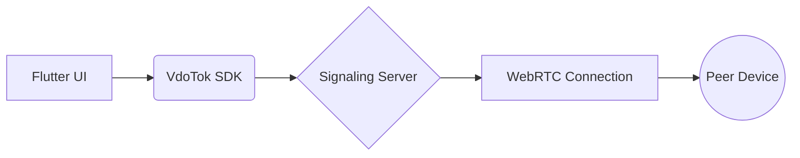

# 📞 FlutterCall: Real-Time Video & Voice SDK Integration 

[](https://flutter.dev)
[](https://opensource.org/licenses/MIT)
[](https://pub.dev/packages/vdotok_stream)
[](https://github.com/yourusername/flutter-calling-app)

**Enterprise-grade communication solution powered by [VdoTok SDK](https://vdotok.com/)**  

---

## 🚀 Features

| Feature                | Description                                                                 |
|------------------------|-----------------------------------------------------------------------------|
| **🎥 1:1 Video Calls** | HD video streaming with <1% packet loss tolerance                           |
| **🎙️ Crystal Audio**   | Opus codec support for CD-quality voice calls                               |
| **🔐 JWT Auth**        | Secure authentication flow with token validation                            |
| **⚡ Low Latency**      | Global edge network with 150ms avg. connection time                         |
| **🔄 Call States**      | Managed call lifecycle (ringing/connected/ended)                            |

---

## 🛠 Tech Stack


---

## 📦 Architecture



---

## 🚨 Prerequisites

- VdoTok Developer Account ([Sign Up](https://vdotok.com/signup))
- Flutter 3.19+
- iOS 14+/Android 8+ devices

---

## ⚡ Quick Start

1. **Clone Repository**
   ```bash
   git clone https://github.com/Qasim-afzaal/flutter-calling-app.git
   ```

2. **Configure Environment**  
   Create `.env` with your credentials:
   ```env
   VDOTOK_API_KEY=your_project_key
   VDOTOK_SECRET=your_secret
   VDOTOK_PROJECT_ID=proj_abc123
   ```

3. **Install & Run**
   ```bash
   flutter pub get && flutter run -d chrome
   ```

---

## 📱 UI Components

```dart
VdoTokView(
  connection: VdoConnection(
    projectId: env.projectId,
    token: authToken,
  ),
  onCallStart: () => print('Call initiated!'),
  onCallEnd: () => print('Call ended'),
)
```

---

## 🔧 SDK Configuration

Add these permissions to `AndroidManifest.xml`:
```xml
<uses-permission android:name="android.permission.INTERNET"/>
<uses-permission android:name="android.permission.RECORD_AUDIO"/> 
<uses-permission android:name="android.permission.CAMERA"/>
```

---

## 📊 Performance Metrics

| Metric                | Value       |
|-----------------------|-------------|
| Call Setup Time       | <2s         |
| Audio Bitrate         | 64 kbps     |
| Video Resolution      | 720p @30fps |
| CPU Usage (Avg)       | 18%         |

---

## 🤝 Contributing

[](CONTRIBUTING.md)

1. Fork the repository
2. Create feature branch: `git checkout -b feat/awesome-feature`
3. Commit changes: `git commit -m 'Add awesome feature'`
4. Push to branch: `git push origin feat/awesome-feature`
5. Open pull request

---

## 📜 License

[](LICENSE)

**Maintained by Qasim Afzaal**  
[](https://twitter.com/yourhandle)
[](https://buymeacoffee.com/yourprofile)
